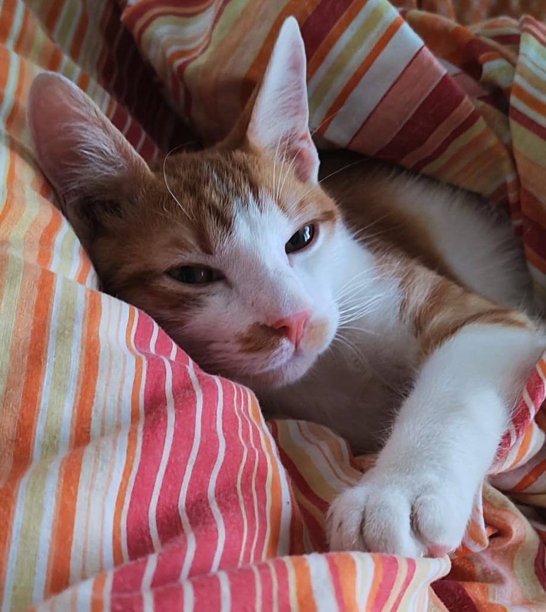
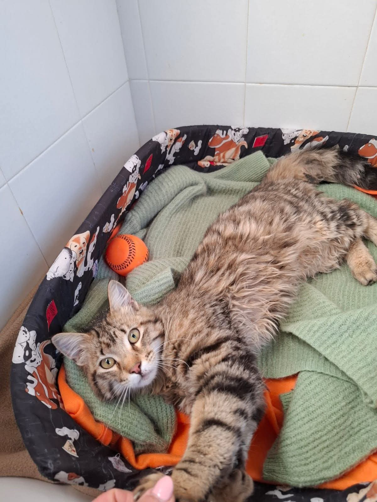
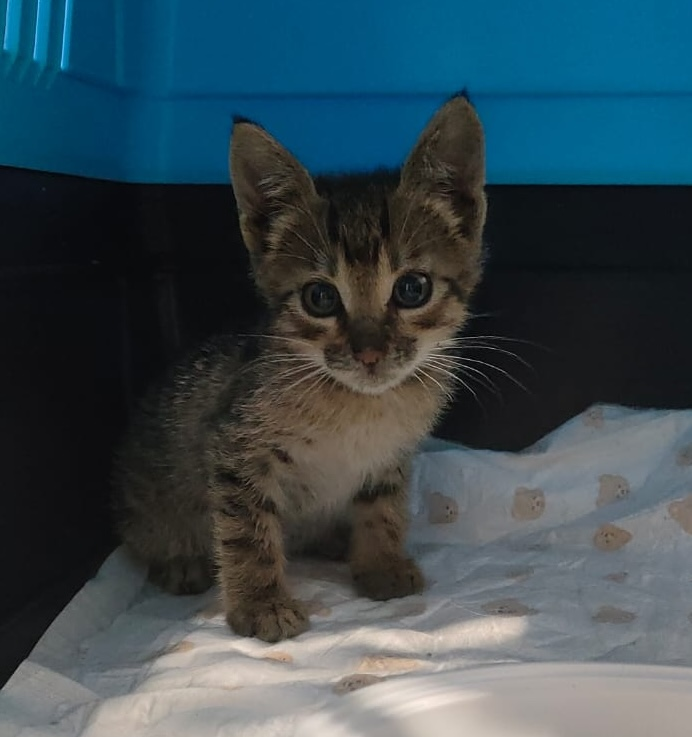
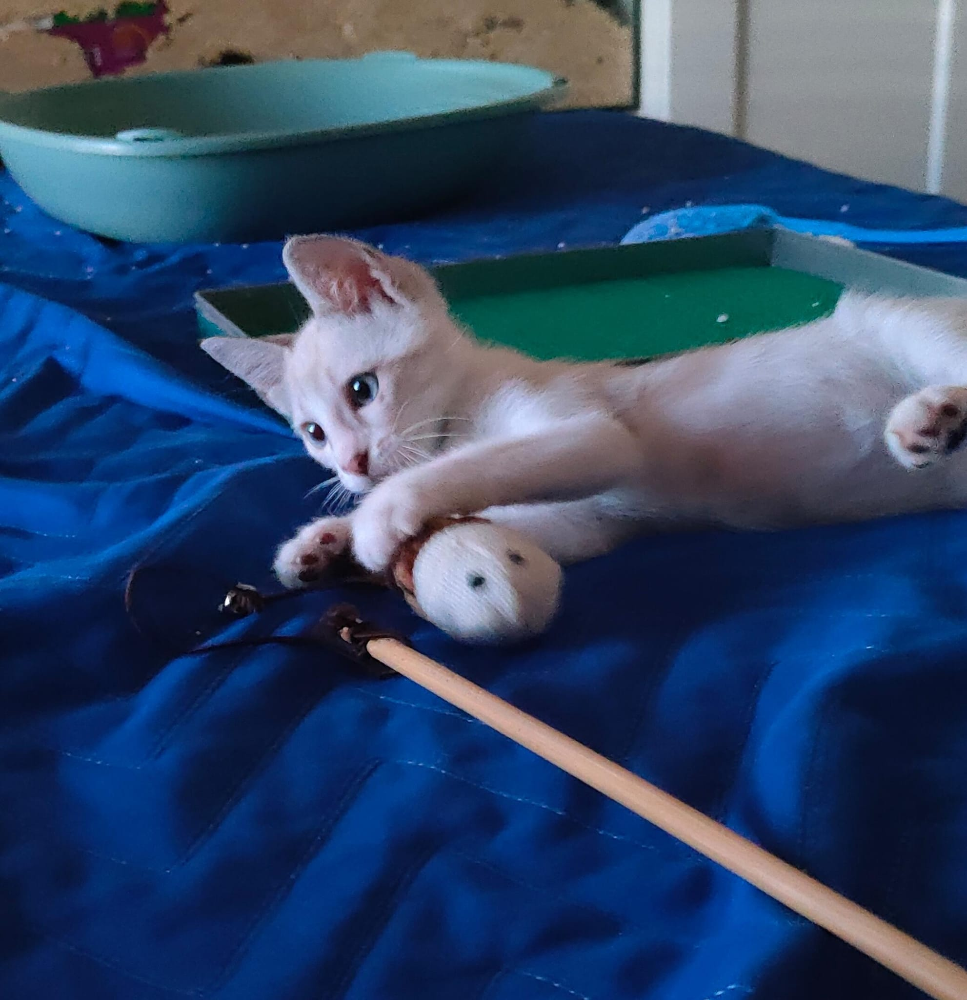
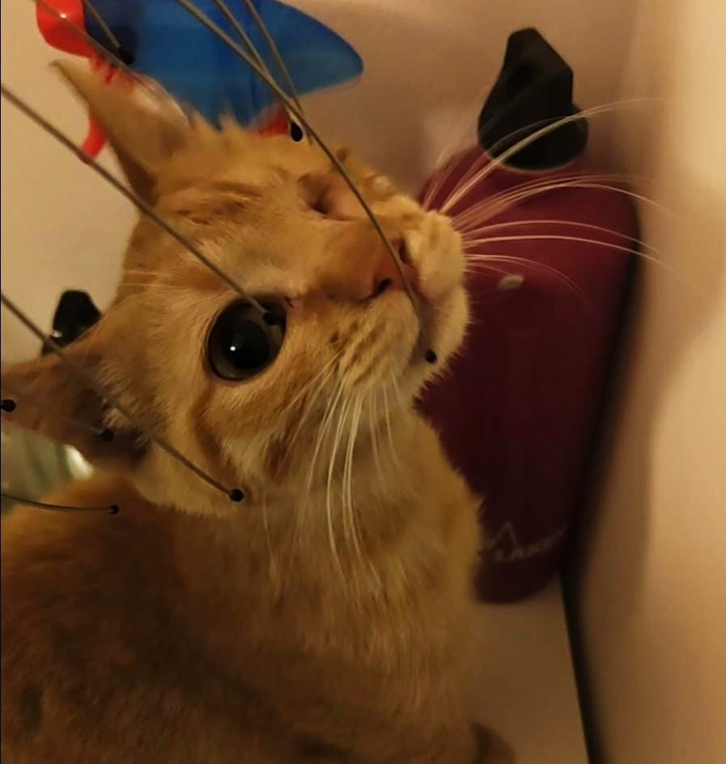
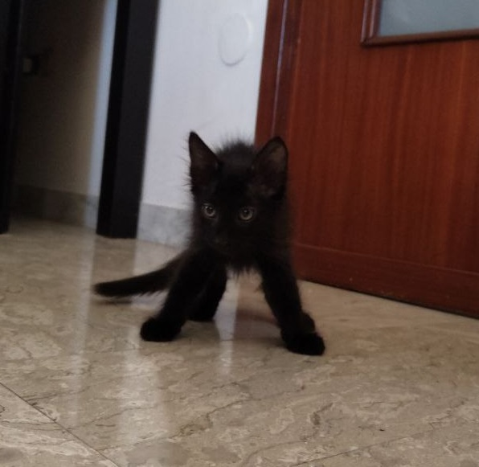
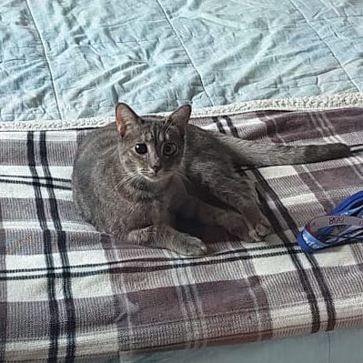
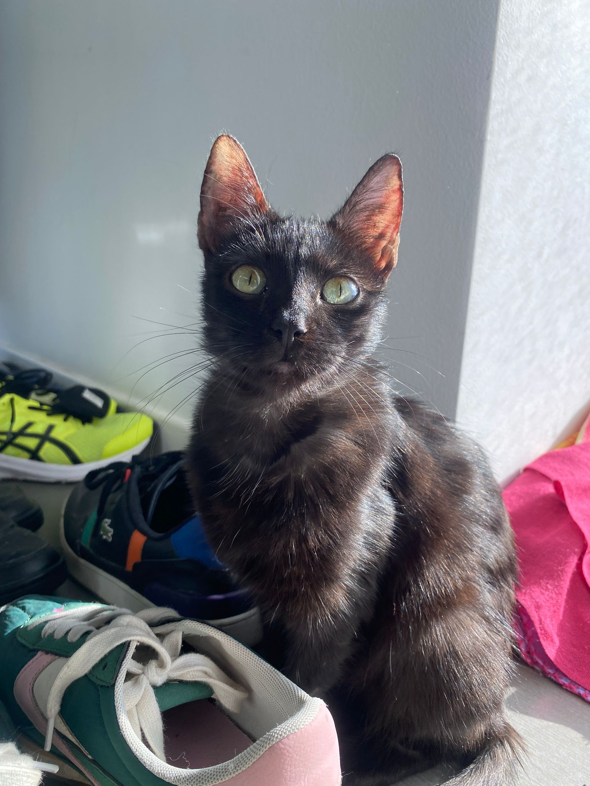

# My Cats

## Nacho "El Guapo" Naranja

Found with broken femurs and abdomen near the beach when he was 6 months old. Currenlty living his best life (at home, biting my feet) 

---

## Java Javolin

Rescued from a shelter after he was found chained to a tree. He's currently disturbing Nacho's sleep (at home, also biting my feet) 

---

# Fostered Kittens

## Gaza

Poor little boy found under a car, covered in fleas. Adopted the day after by a lovely lady 

---

## Kenpachi

Found in a car engine, needed some time to warm up to humans. Found its lifetime companion and forever home 

---

## Valentino

Cute orange cat missing an eye and with a broken tail, bullied by other cats in his colony. Found his forever home in Florence 

 

---

## Draco

Nightmare fuel furball

---

## Crystal Lasaracina

The shadow assassin, eyes destroyer from Luca, occupied my home while her master was finding eternal love in Egypt 

 

---

## Abas

Broke my glass, gave Nacho, Java and Crystal mycosis, but very cute overall 

 

---

